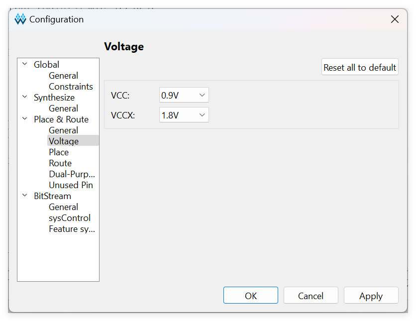

# ws2812_hsv - a WS2812 demo with RGB to HSV convertor for Sipeed Tang FPGA Boards

This project is a demo to test the WS2812 on FPGA, it base on Sipeed [Tang MEGA 60K](https://wiki.sipeed.com/hardware/en/tang/tang-mega-60k/mega-60k.html), This demo uses a lookup table to convert the RGB color space to the HSV color space, and allows the WS2812 to cycle through changing colors while basically maintaining the same brightness.

Main features,

- Conversion from RGB color space to HSV color space.
- Make WS2812 cycle color change.
- IP-less design, easy to port to other FPGA.

This demo now is only test on Sipeed [Tang MEGA 60K](https://wiki.sipeed.com/hardware/en/tang/tang-mega-60k/mega-60k.html), which mainchip is **GW5AT-LV60GG484AC1/l0** or **GW5AT-LV60PG484AES**.   

## Directory structure

```
| -- docs                       --> manuals and documentation   
|    |`-- images                --> picture resources  
| -- cam2dvi 
|    |-- src                    --> project sources 
|    |-- impl                   --> project config & implementation 
|    |
|    |`-- ws2812.fs.7z          --> prbuild bitstream(zipped)                       
|    |`-- ws2812.gprj           --> demo project
|    |`-- ws2812.gprj.user      --> project conf.

```

## Getting start

Please confirm that you have the following conditions:
- GOWIN IDE Version ≥ 1.9.10.01
- **DO NOT** use GOWIN Programmer version **1.9.10.02**, for this version contains many issues many issues with **onboard debugger**(BL616).
- Sipeed [Tang MEGA 60K](https://wiki.sipeed.com/hardware/en/tang/tang-mega-60k/mega-60k.html)
- USB-C date cable, use to connect the board to your PC.

## Attention

The VCCX should be set to 1.8V due to hardware design of **Sipeed [Tang MEGA 60K](https://wiki.sipeed.com/hardware/en/tang/tang-mega-60k/mega-60k.html)**
In GOWIN IDE, this configuration item is located in the **project(menu)-Configuration-Place & Route-Voltage-VCCX**



## How to use

Here are quick instructions for the more experienced,
- Connect your board to your PC via an USB-C cable.
- Download & Complie the project, then downloading the bitstream to you board.
- You can also try using the prebuilt bitstream, but remember to unzip it before downloading.
- Observe whether the WS2812 is cycling and changing color.

## LEDs & button

This demo does not use any LEDs to indicate status, perhaps the WS2812 is also a LED?
1 button **(S0)** use to reset the demo.  

## Development
Please refer to the source code in the project for details.